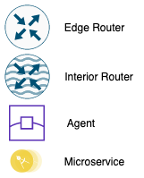
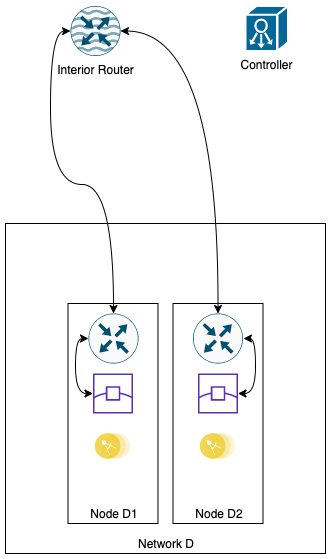
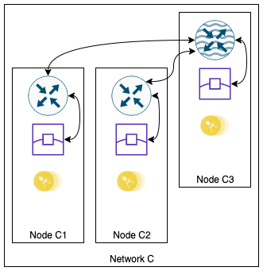
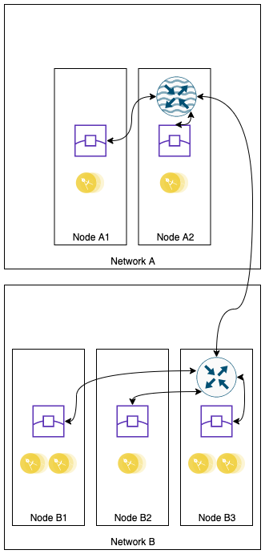
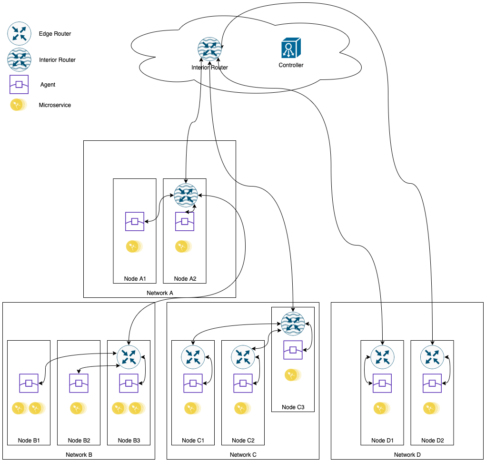

# 1. Introduction 
ioFog is an edge computing platform for deploying, running, and networking distributed microservices at the edge.

ioFog aims to make developing edge software just like developing for the cloud. Distributed Internet of Things (IoT) applications let you put your code at the edge, bring legacy devices into the IoT, and keep data anywhere you want.

# 2. Components

## 2.1 Agent
An ECN running ioFog is made up of one or more devices, referred to as nodes. Each node runs a daemon service called an Agent. Each node's Agent locally handles the starting, stopping, and management of the one or more microservices running on that particular node. These microservices are deployed as Linux kernel containers (LXC), commonly using Docker.

While the Agent daemon is a CLI, after setting things up a majority of your management tasks—such as starting/stopping microservices—will instead be done using the Controller, which controls the Agent on your behalf, remotely. This allows you to deploy and maintain microservices without needing to SSH directly onto every edge node device.

## 2.2 Controller
Since your ECN is likely distributed - composed of many different devices across networks, each with potentially differing microservices - a piece of software called the `Controller` is used for orchestration of the different Agents.

Because the Controller daemon keeps track of all your Agents, even across complicated network configurations, you can use it to maintain the entire fleet, remotely. Small ECNs will only need a single Controller, however, running multiple Controllers is also supported for increased resiliency.

The Controller can run on any compatible hardware that is network accessible by all of your edge nodes running an Agent. Usually that means either having a static IP address or DNS records. A common solution is to run your Controller on a cloud provider like `Amazon Web Services` or `Google Cloud Platform`, but it's also possible to run the Controller directly on one of your edge nodes or other local hardware. Controller can be installed on Kubernetes cluster as well.

Once your ECN running ioFog is up and running, you'll use your Controller as the primary interface to maintaining your microservices and the nodes they run on.

## 2.3 Router
If your microservices need to communicate with other microservices or nodes in your network, ioFog includes an optional component called `Router`. Routers could be deployed on your edge nodes, your ECN or Kubernetes cluster.

Routers can be deployed as interior or edge. In interior mode, the router operates in cooperation with other interior routers in an interconnected network. In edge mode, the router can make an uplink to an interior router and join a network.

## 2.4 Proxy
Sometimes you're running microservice(s) that have open ports (like a microservice that provides Web UI) at the edge and would like to have access to those ports from internet or some machine on your local network. `Proxy` gives you the ability to acheieve that goal.

## 2.5 iofogctl
`iofogctl` is a CLI tool for installation, configuration, and operation of ioFog ECNs.

It can be used to remotely manage multiple different clusters from a single host. It is built for an ioFog user and a DevOps engineer who may want to manage ioFog clusters.

# Architecture
TBD

TBD

## Basic deployment  

TBD

## Subnet connectivity  

TBD

## Inter-network connectivity  

TBD

## Complete  

TBD
